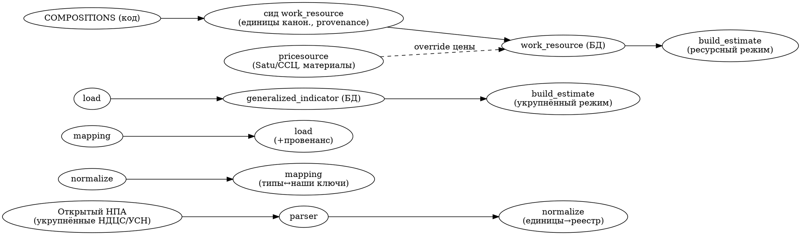

# Госкаталог цен РК + методика единиц — дизайн (Phase 1, гибрид)

**Дата:** 2026-06-28
**Статус:** на ревью
**Контекст:** продолжение ресурсной сметы (v0.3). Сейчас цены и нормы расхода —
ориентировочные значения, захардкоженные в `app/calc/resource_catalog.py`
(`COMPOSITIONS`) и `app/calc/pricing.py` (`PRICES`). Задача — навести порядок в
единицах ресурсного метода и подготовить наполнение **официальными данными РК**.

## Решения, зафиксированные с заказчиком

1. **Источник:** только открытые НПА (без скрейпинга платного ЕГФ НТД / Параграфа).
2. **Глубина:** полная ресурсная база — целевая, но...
3. **...способ:** **гибрид** — строим полную схему + методику единиц + пайплайн
   импорта сейчас; наполняем **открытыми укрупнёнными показателями** (НДЦС/УСН РК)
   немедленно; слой **единичных расценок (ЕРЕР)** добиваем лицензионной Excel-выгрузкой
   позже (отдельная фаза, вне этой спеки).

### Что показала разведка (обоснование гибрида)
- Единичные расценки ЕРЕР (НДЦС РК 8.04-03) и сборники ЕНиР на prg.kz/online.zakon.kz
  открыты только как **«Демо-версия»**: видны общие положения и коэффициенты, сами
  таблицы с чел-ч/маш-ч — **за подпиской**. Полную базу продаёт ЕГФ НТД (ksm.kz) и
  лицензируют сметные программы (СМЕТА РК/АВС-4/SANA, экспорт в Excel).
- Открыто и парсимо: методики, **укрупнённые показатели** (НДЦС РК 8.02-01 /
  УСН РК 8.02-04 по областям), коэффициенты/индексы.
- **Юридический флаг (для заказчика):** даже при наличии подписки/лицензии право
  «составлять сметы» ≠ право «встраивать базу расценок в продукт и раздавать».
  Текст лицензии на ЕРЕР-слой проверяет заказчик до фазы 2.

## Цель Phase 1

Source-agnostic фундамент:
1. Вынести ресурсный каталог из кода в **БД** (наполняемый без правок кода).
2. Ввести **реестр канонических единиц** + валидация (порядок в чел-ч/маш-ч/деньги).
3. Добавить поля официальной методики: **разряд** труда, **код** ресурса, **провенанс**
   (источник, уровень цен, регион, дата).
4. Построить **пайплайн импорта** (парсер → нормализация единиц → маппинг → загрузка).
5. Наполнить **открытыми укрупнёнными показателями** → новый «укрупнённый» режим/якорь.

Не входит (Phase 2+): полный импорт ЕРЕР; раскрытие маш-ч на (амортизация+ЗП
машиниста+ГСМ); автоматизация региональных индексов; UI-редактор каталога.

## Архитектура

Сейчас: `COMPOSITIONS` (код) → `snapshot_for(key)` → `rollup` → строка сметы;
`PriceItem` (БД, материалы/работы плоско) через `get_price`; `pricesource/` адаптеры
(только материалы). Расчёт в `build_estimate`.

Target — те же точки расчёта, но каталог и единицы из БД с провенансом.

### Модель данных (новые таблицы, SQLite, ALTER-guard как в init_db)

**`units` — реестр единиц.**
- `code` (PK): `чел-ч`, `маш-ч`, `маш-см`, `м3`, `м2`, `т`, `кг`, `шт`, `компл`, `л`, `км`
- `title` (str), `dimension` (enum: `labor_time|machine_time|mass|volume|area|count|length|set`), `note`
- Назначение: валидация — единица ресурса обязана существовать в реестре и
  соответствовать `kind` (labor→labor_time, machine→machine_time/маш-см,
  material→mass/volume/area/count/length/set).

**`work_resource` — ресурсный состав работ (вынос `COMPOSITIONS` в БД).**
- `id` (PK)
- `work_key` (index): наш ключ работы (`frame_concrete`, `partitions`, …)
- `code`: код ресурса (наш; опц. официальный код ЕРЕР/ССЦ в `official_code`)
- `official_code` (nullable): код из официального сборника, когда появится
- `name`, `kind` (`material|labor|machine`)
- `unit` (FK→`units.code`)
- `consumption` (float): норма расхода на единицу работы
- `rank` (nullable int|str): разряд (для labor — средний разряд)
- `price` (float): цена за единицу ресурса (inline, как сейчас в ResourceSpec)
- `source` (`seed|ndcs|erer|ssc|manual`): провенанс данных
- `price_level` (nullable): уровень цен (напр. `рынок-2026`, `ССЦ-2026-Астана`)
- `region` (default `KZ`), `needs_review` (bool), `updated_at`
- Уникальность: (`work_key`, `code`, `region`, `price_level`) — для идемпотентного upsert.
- Сид: `COMPOSITIONS` грузятся в `work_resource` на старте (идемпотентно, как
  `seed_prices`), `source="seed"`, `price_level="рынок-Астана-2026"`.

**`generalized_indicator` — укрупнённые показатели (открытый сид НДЦС/УСН РК).**
- `id` (PK)
- `object_type` (index): тип объекта (маппинг на наши `object_type`)
- `region`, `year`, `price_level`
- `value` (float), `unit` (FK→`units.code`): напр. ₸ за `м2` общей площади
- `source_code` (напр. `НДЦС РК 8.02-01-2025`), `source_url`, `note`, `needs_review`
- Назначение: новый «укрупнённый» режим оценки и/или якорь-сверка к сумме ресурсов.

> Цену материалов по-прежнему можно переопределять через `pricesource/` (Satu/ССЦ) —
> адаптер пишет в `work_resource.price` ресурсов-материалов с `source`/`price_level`.

### Режимы расчёта

- **Ресурсный** (текущий): Σ ресурсов из `work_resource`. Phase 1 наводит порядок в
  единицах и провенансе; цены пока «рынок-2026» (официальные ЕРЕР — Phase 2).
- **Укрупнённый** (новый): grand-оценка = площадь × `generalized_indicator.value`
  (официальный показатель РК). Быстрый, класс 5, официально обоснован. Включается
  флагом; в смете честная пометка источника.

### Пайплайн импорта (`app/gosdata/`)

- `parsers/` — подключаемые: `ndcs_generalized.py` (укрупнённые из открытых НПА:
  HTML/PDF/Excel); каркас `erer.py` (Phase 2, из лицензионного Excel) — заглушка с
  интерфейсом.
- `normalize.py` — приведение единиц к реестру `units`; конвертации; флаг несоответствий.
- `mapping.py` — таблицы соответствия: официальные коды/типы ↔ наши `work_key`/`object_type`.
- `load.py` — идемпотентный upsert в БД с провенансом.
- Запуск: management-команда `python -m app.gosdata.import <parser> <file>`.

### Поток данных
`открытый НПА (укрупнённые)` → `parser` → `normalize (единицы)` → `mapping (типы)` →
`load (generalized_indicator, провенанс)` → `укрупнённый режим в build_estimate`.
Ресурсный каталог: `COMPOSITIONS` → сид в `work_resource` (единицы канонизированы,
provenance проставлен). Цены материалов опц. → `pricesource` → override `work_resource`.

### Обработка ошибок
- Импорт: парс-ошибка строки → строка в карантин-лог, не валит весь импорт;
  итоговый отчёт (загружено/пропущено/несоответствия единиц).
- Расчёт: если `work_resource` пуст для `work_key` → fallback на плоский `PriceItem`
  (текущее поведение `get_price`), смета не падает.
- Несоответствие единицы реестру → `needs_review=True` + предупреждение в смете.

## Совместимость и миграция

- `ResourceLine`/`ResourceSpec`-форма не меняется — добавляются поля (`rank`,
  `official_code`, провенанс). Аддитивно.
- БД: новые таблицы через `create_all`; новые колонки — guarded ALTER (паттерн уже
  есть в `init_db` для object/zone).
- **Парность итогов:** каталог из БД на сид-данных обязан давать те же суммы, что
  текущий хардкод (в пределах округления) — гарантируется тестом-регрессией.

## Тестирование

- `units`: валидатор отвергает несуществующую единицу и kind↔dimension-несоответствие.
- `work_resource`: идемпотентность сида (повторный сид не плодит строк); upsert по
  ключу; парность `rollup` из БД vs текущий хардкод (нет регрессии итогов).
- `generalized_indicator`: укрупнённый режим даёт grand = площадь×показатель;
  провенанс присутствует.
- Пайплайн: парсер укрупнённых на фикстуре-НПА → корректные строки; нормализация
  единиц; карантин битой строки.
- Fallback: пустой `work_resource` → плоский `PriceItem`, смета считается.

## Фронтенд (Phase 1, минимально)

- В смете — пометка **источника и уровня цен** (провенанс) и бейдж режима
  («укрупнённый РК» / «ресурсный»). Правка ресурсов уже есть.
- Полный UI-редактор каталога/единиц — отдельная задача (Deferred).

## Открытые вопросы к ревью

1. **Укрупнённый режим** — отдельная кнопка/режим оценки, или только как
   якорь-сверка к ресурсной сумме (предупреждение при расхождении >X%)? (дефолт: и то,
   и другое — режим + сверка).
2. **Цена в `work_resource` inline vs отдельная таблица цен** по (код ресурса×регион×
   уровень). Phase 1 — inline (проще миграция); вынос в отдельную таблицу — когда
   подключим ССЦ по регионам (Phase 2). Ок?
3. Стартовый набор укрупнённых: какой тип объекта/регион первым (дефолт: жилой дом,
   Астана, НДЦС РК 8.02-01 последнего года)?
4. Машино-часы: Phase 1 оставляем blended маш-ч (как сейчас), раскрытие на состав —
   Phase 2. Ок?

## Поток данных (диаграмма)

